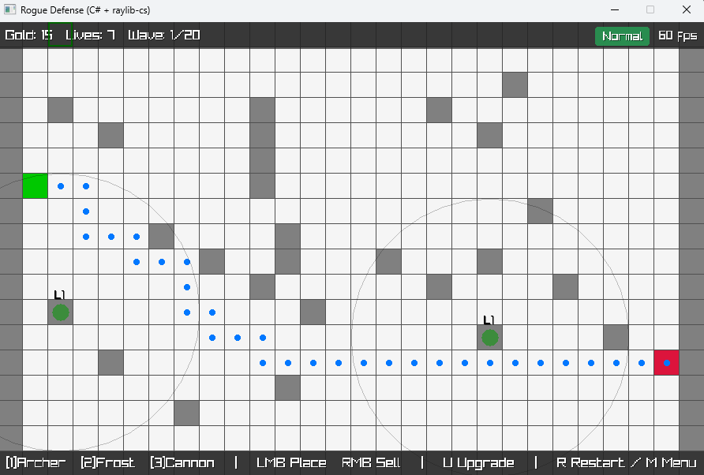

# 🏰 Rogue Defense

A simple but challenging **Tower Defense game** built in **C#** with [raylib-cs].  
You place towers, defend your base, and survive against endless waves of enemies — each wave stronger than the last.  

---

## 🎮 Gameplay
- Place towers on the grid to stop enemies.
- Different tower types:
  - 🏹 **Archer** – fast and reliable.
  - ❄️ **Frost** – slows enemies down.
  - 💣 **Cannon** – area damage.
- Enemies come in waves — survive as long as you can.
- Choose your **difficulty**: Easy, Normal, Hard, or Brutal.

👉 Example screenshot of the game:  



---


### ⚡ Controls

| Key | Action |
|-----|--------|
| **1** | Select Archer Tower |
| **2** | Select Frost Tower |
| **3** | Select Cannon Tower |
| **U** | Upgrade selected tower |
| **LMB** | Place tower |
| **RMB** | Sell tower |
| **R** | Restart (after game over) |
| **M** | Return to menu (after game over) |

---

### Project Structure 📂

```RogueDefense/
├── src/             # Game source code
├── RogueDefense.csproj
└── README.md
```

---

### Run the game

Clone this repo and run:

```git clone https://github.com/AlanAkandzhi/RogueDefense.git
cd RogueDefense
dotnet run
```
